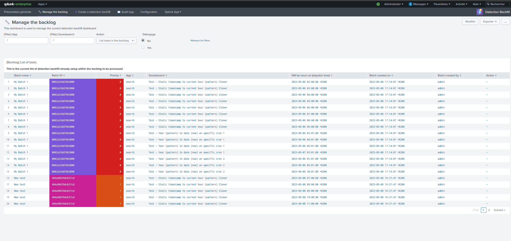

<p align="center">
  
</p>

# Table of content

- [Table of content](#table-of-content)
- [Introduction](#introduction)
- [Use Cases](#use-cases)
- [Functionalities](#functionalities)
- [Installation](#installation)
- [Configuration](#configuration)
  - [Logging](#logging)
- [Usage](#usage)
  - [Create a detection backfill](#create-a-detection-backfill)
    - [From the dashboard](#from-the-dashboard)
    - [From any search using a custom command and custom alert action](#from-any-search-using-a-custom-command-and-custom-alert-action)
  - [Backlog](#backlog)
  - [Scheduling of re-runs](#scheduling-of-re-runs)
- [Credits](#credits)
- [License](#license)

# Introduction

This TA can be used to **fill in detection gaps following a period of data collection interruption**. Once data are recovered in Splunk, this application can be used to restart scheduled searches during this outage.

Detection backfill naming is a reference to the data backfilling process which aims to recover old data to fill gaps. As we are focusing on re-running savedsearches or correlation searches, we are talking about detection backfilling.


*Example of the overview dashboard*

# Use Cases

The objective is to provide an easy way to relaunch savedsearches (or correlation searches) on an outage period of time
when data weren't available. As soon as you have retrieved your data, you might want to re-run your detections over this
old period of time that didn't ran correctly as no data was collected.

However, whatever is the outage period range, we don't want to impact the performances of the Splunk infrastructure if we need to re-run old detections. In order to respect this, this application is based on a backlog that will be used to process re-runs progressively and not everything at once.

This application can interest you if you are looking for:

- A way to re-run savedsearches or correlation searches easily on past data after an outage period of data collection
- A way to re-run savedsearches or correlation searches easily when you detect an anomaly in your detections that could have miss some interesting events in the past

# Functionalities

This application is providing you several features to achieve your goal:

- An easy way to add new tasks into the backlog from a custom alert action or to re-run manually backfills
- A dedicated dashboard is helping you to find all the re-runs needed to be dispatched by providing an outage period range and a regexp to match all the savedsearches concerned.
- You can set up multiple re-run batches to have dedicated re-run groups. These batches can have different priorities in the backlog in order to be re-run more or less quickly.
- You can manage the backlog to remove non-essential re-run if needed
- You have a full audit dashboard to help you understanding the execution/progress of the re-runs and identify any issue quickly

# Installation

This application doesn't require any specific installation setup to be running as it's based on Splunk core functionalities. It can be installed and used as is.

# Configuration

## Logging

You can enable a "debug" logging mode (under **Configuration**) to have more information in searches/logs.
By default, all logging files are created under `$SPLUNK_HOME/var/log/splunk/`

You will be able to have these logs in your search.log too.


*Example of the audit logs dashboard (1)*


*Example of the audit logs dashboard (2)*

# Usage

## Create a detection backfill

### From the dashboard


*Dashboard: Create a detection backfill*

This dashboard is helping you to generate a list of re-runs based on an outage period and a regular expression to know which savedsearches must be taken into account (disabled and non-schedule savedsearches aren't taken into consideration)

You can use the two input fields on the first panel named "1. Calculate all (re)dispatch times" to generate all the detections matching the regular expression to be re-run by dispatch time to cover the outage period.

If you feel confortable with the provided results, you can create a new batch on the second panel named "2. Add results to the backlog for processing" using the two inputs to provide a name for your batch and a priority. Priority is used to evaluate when the re-run must be done. Highest (0) priorities will be managed in prior of other priorities.

The priority order is:

`Highest(0) > High (1) > Medium (2) > Low (3) > Lowest (4)`

For example, if you create a batch with a priority "High (1)" and an existing batch is already existing in the backlog with a priority "Medium (2)", the new created batch will be processed in priority.

### From any search using a custom command and custom alert action

Actually, the dashboard is using a custom command to generate all the re-run.
You can use the command as this:

```python
... (search)
| script backfill_detection_evaluate_savedsearches_to_rerun
```

This script is expecting to have events with three fields:

- **outage_period_earliest**: Indicates the earliest time of the outage period
- **outage_period_latest**: Indicates the latest time of the outage period
- **savedsearches_regex**: Indicates the regular expression to apply on the savedsearches to know if need to consider them or not (disabled and non-schedule savedsearches aren't taken into consideration)

If you provide several events to the script, it will process each event indenpendently and return all the results at once.

In order to add new backfills into the backlog, you can rely on a custom alert action to help you:


*Custom alert action: Add a backfill to the backlog*

## Backlog


*Dashboard: Manage the backlog*

This dashboard is used to list the backlog tasks and see the order of all detections to be re-run.

Each time a new batch is added to the backlog, it's sorted by "Batch priority" (Minor values are more prior) then by the "Savedsearch name" (alphabetical order)

In this dashboard, you can list all re-runs or delete one of the savedsearch re-run.

## Scheduling of re-runs


*Savedsearch: Run the next scheduled detection backfill and Custom alert action: Run the next backfill*

Re-runs scheduling is made using a dedicated scheduled savedsearch in the application named "Run the next scheduled detection backfill". This savedsearch is generated as many events as we want to re-run backfills from the backlog at the same time (2 by default).

A custom alert action named "Run the next backfill" is executed to process as many tasks in the backlog as events from the search.

> **Note**: As you can see, you can select if you want (or not) execute the triggers of your savedsearches if the trigger condition is met. If yes, then all trigger actions (custom alert actions) will be executed as soon as the re-run job is finished.

# Credits

This application was largely inspired from the [Splunk rerun app](https://github.com/murchisd/splunk_rerun_app) made by Donald Murchison

[Repeat icons created by Freepik - Flaticon](https://www.flaticon.com/free-icons/repeat)

# License

MIT License

Copyright (c) 2023 LmR

Permission is hereby granted, free of charge, to any person obtaining a copy
of this software and associated documentation files (the "Software"), to deal
in the Software without restriction, including without limitation the rights
to use, copy, modify, merge, publish, distribute, sublicense, and/or sell
copies of the Software, and to permit persons to whom the Software is
furnished to do so, subject to the following conditions:

The above copyright notice and this permission notice shall be included in all
copies or substantial portions of the Software.

THE SOFTWARE IS PROVIDED "AS IS", WITHOUT WARRANTY OF ANY KIND, EXPRESS OR
IMPLIED, INCLUDING BUT NOT LIMITED TO THE WARRANTIES OF MERCHANTABILITY,
FITNESS FOR A PARTICULAR PURPOSE AND NONINFRINGEMENT. IN NO EVENT SHALL THE
AUTHORS OR COPYRIGHT HOLDERS BE LIABLE FOR ANY CLAIM, DAMAGES OR OTHER
LIABILITY, WHETHER IN AN ACTION OF CONTRACT, TORT OR OTHERWISE, ARISING FROM,
OUT OF OR IN CONNECTION WITH THE SOFTWARE OR THE USE OR OTHER DEALINGS IN THE
SOFTWARE.
