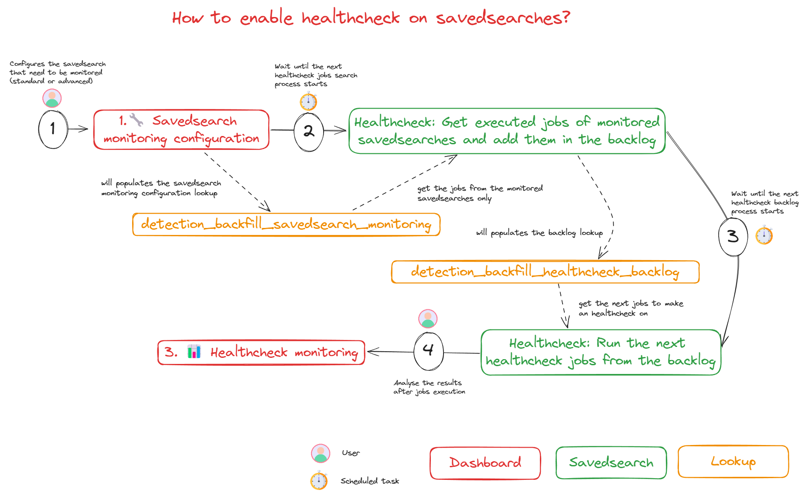
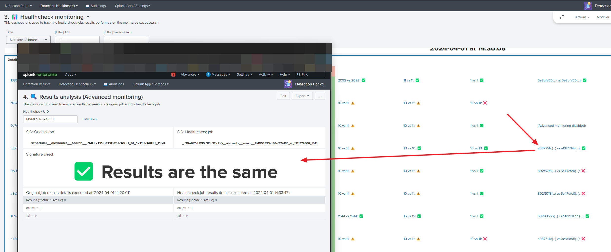

<p align="center">
  
</p>

- [Introduction](#introduction)
  - [Problem to solve](#problem-to-solve)
  - [Consequences](#consequences)
- [Use Cases](#use-cases)
- [Installation \& Configuration](#installation--configuration)
  - [Logging](#logging)
- [Usage](#usage)
  - [Detection Rerun](#detection-rerun)
    - [Detection Rerun in a diagram](#detection-rerun-in-a-diagram)
    - [Create a backfill batch](#create-a-backfill-batch)
      - [From the dashboard](#from-the-dashboard)
      - [From any search using a custom command and custom alert action](#from-any-search-using-a-custom-command-and-custom-alert-action)
    - [Backlog](#backlog)
    - [Scheduling of re-runs](#scheduling-of-re-runs)
    - [Code injection for reruns](#code-injection-for-reruns)
  - [Detection Healthcheck](#detection-healthcheck)
    - [Explanation with examples](#explanation-with-examples)
      - [Example: Savedsearch job execution](#example-savedsearch-job-execution)
      - [Example: Healthcheck job running with an additional scanned events (but not matching the search query)](#example-healthcheck-job-running-with-an-additional-scanned-events-but-not-matching-the-search-query)
      - [Example: Healthcheck job running with an additional scanned events (and matching the search query without changing the results count)](#example-healthcheck-job-running-with-an-additional-scanned-events-and-matching-the-search-query-without-changing-the-results-count)
      - [Example: Healthcheck job running with an additional scanned events (and matching the search query with an impact on the results count)](#example-healthcheck-job-running-with-an-additional-scanned-events-and-matching-the-search-query-with-an-impact-on-the-results-count)
      - [Example: Healthcheck job running without any change on the available events](#example-healthcheck-job-running-without-any-change-on-the-available-events)
    - [Detection Healthcheck in a diagram](#detection-healthcheck-in-a-diagram)
    - [Set up the monitoring for a savedsearch](#set-up-the-monitoring-for-a-savedsearch)
      - [What is the difference between "standard" and "advanced" monitoring?](#what-is-the-difference-between-standard-and-advanced-monitoring)
      - [What is the consequence to enable the monitoring for one search?](#what-is-the-consequence-to-enable-the-monitoring-for-one-search)
    - [Understanding how healthcheck jobs are run](#understanding-how-healthcheck-jobs-are-run)
    - [Understanding how the healthcheck jobs backlog is processed](#understanding-how-the-healthcheck-jobs-backlog-is-processed)
    - [Monitor the healthcheck jobs results](#monitor-the-healthcheck-jobs-results)
    - [Advanced monitoring: Get results content comparaison](#advanced-monitoring-get-results-content-comparaison)
      - [Case #1: Same results](#case-1-same-results)
    - [Case #2: Results are different](#case-2-results-are-different)
    - [Case #3: Advanced monitoring isn't enabled](#case-3-advanced-monitoring-isnt-enabled)
- [Credits](#credits)
- [License](#license)

# Introduction

## Problem to solve

This TA can be used to **fill in detection gaps following a period of data collection interruption/disruption**.
Several scenarios can be overseen:

- **Scenario 1**: Log collection was stopped due to an issue between a datasource and Splunk. An outage period means that we didn't got the data in Splunk resulting in a loss of logs.


- **Scenario 2**: Log collection is delayed due to an issue between a datasource and Splunk. Data are collected but with a significant difference between the **time the event (called "time" in the diagrams or the field "_time" in Splunk)** occurred (and a log was created on the data source) and the **time the log is indexed ("called "index time" in the diagrams or the field "_index_time" in Splunk)** in Splunk.


## Consequences

As a result of the previous scenarios, detections might not be working properly as the data weren't available at the time of the search.

For the scenario 1, it results as:


For the scenario 2, it results as:


Detection backfill naming is a reference to the data backfilling process which aims to recover old data to fill gaps. As we are focusing on re-running savedsearches or correlation searches, we are talking about detection backfilling.

# Use Cases

The objective is to provide an easy way to relaunch savedsearches (or correlation searches) on an outage period of time when data weren't available (either not collected at all or not indexed in time). As soon as you have retrieved your data, you might want to re-run your detections over those old periods of time that didn't ran correctly as data weren't fully available.

However, whatever is the outage period range, **we don't want to impact the performances of the Splunk infrastructure** if we need to re-run old detections. In order to respect this, this application is based on a backlog that will be used to process re-runs progressively and not everything them all at once.

This application can interest you if you are looking for:

- A way to re-run savedsearches or correlation searches easily on past data after an outage period of data collection
- A way to re-run savedsearches or correlation searches easily when you detect an anomaly in your detections that could have miss some interesting events in the past

As we build up the individual savedsearches so that they are rerun in the same context as they should have been run, this means that you can reschedule these searches, even over large periods, as the backlog will be filled with all the time slots that need to be covered. Even if thousands of time slots are created in the backlog, they will be processed progressively at the speed at which you want them to run.

# Installation & Configuration

This application doesn't require any specific installation setup to be running as it's based on Splunk core functionalities. It can be installed and used as is.

## Logging

You can enable a "debug" logging mode (under **Configuration**) to have more information in searches/logs.
By default, all logging files are created under `$SPLUNK_HOME/var/log/splunk/`

You will be able to have these logs in your search.log too.

**A dedicated dashboard named "Audit logs" is available in the app** to track all the logs generated by the application itself. If any issue is happening with the application, you can rely on this dashboard to investigate the problem.


*Example of the audit logs dashboard (1)*


*Example of the audit logs dashboard (2)*

# Usage

## Detection Rerun

Once data are recovered in Splunk, this application can be used to restart scheduled searches during this outage.


For the scenario 1, it results as:


For the scenario 2, it results as:


### Detection Rerun in a diagram


### Create a backfill batch

#### From the dashboard


*Dashboard: Create a detection backfill*

This dashboard is helping you to generate a list of re-runs based on an outage period and a regular expression to know which savedsearches must be taken into account (disabled and non-schedule savedsearches aren't taken into consideration)

You can use the two input fields on the first panel named "1. Calculate all (re)dispatch times" to generate all the detections matching the regular expression to be re-run by dispatch time to cover the outage period.

If you feel confortable with the provided results, you can create a new batch on the second panel named "2. Add results to the backlog for processing" using the two inputs to provide a name for your batch and a priority. Priority is used to evaluate when the re-run must be done. Highest (0) priorities will be managed in prior of other priorities.

The priority order is:

`Highest(0) > High (1) > Medium (2) > Low (3) > Lowest (4)`

For example, if you create a batch with a priority "High (1)" and an existing batch is already existing in the backlog with a priority "Medium (2)", the new created batch will be processed in priority.

#### From any search using a custom command and custom alert action

Actually, the dashboard is using a custom command to generate all the re-run.
You can use the command as this:

```python
... (search)
| script backfill_detection_evaluate_savedsearches_to_rerun
```

This script is expecting to have events with three fields:

- **outage_period_earliest**: Indicates the earliest time of the outage period
- **outage_period_latest**: Indicates the latest time of the outage period
- **savedsearches_regex**: Indicates the regular expression to apply on the savedsearches to know if need to consider them or not (disabled and non-schedule savedsearches aren't taken into consideration)

If you provide several events to the script, it will process each event indenpendently and return all the results at once.

In order to add new backfills into the backlog, you can rely on a custom alert action to help you:


*Custom alert action: Add a backfill to the backlog*

### Backlog


*Dashboard: Manage the backlog*

This dashboard is used to list the backlog tasks and see the order of all detections to be re-run.

Each time a new batch is added to the backlog, it's sorted by "Batch priority" (Minor values are more prior) then by the "Savedsearch name" (alphabetical order)

In this dashboard, you can list all re-runs or delete one of the savedsearch re-run.

### Scheduling of re-runs


*Savedsearch: Run the next scheduled detection backfill and Custom alert action: Run the next backfill*

Re-runs scheduling is made using a dedicated scheduled savedsearch in the application named "Run the next scheduled detection backfill". This savedsearch is generated as many events as we want to re-run backfills from the backlog at the same time (2 by default).

A custom alert action named "Run the next backfill" is executed to process as many tasks in the backlog as events from the search.

> **Note**: As you can see, you can select if you want (or not) execute the triggers of your savedsearches if the trigger condition is met. If yes, then all trigger actions (custom alert actions) will be executed as soon as the re-run job is finished.

### Code injection for reruns

During reruns, you can perform a SPL code injection if you need to change the behavior of the original savedsearch (it might happened). In that case, you have a dedicated dashboard for it named "SPL code injection settings":


If you want to add a new SPL code injection, you can do so by chosing the corresponding input:


A SPL code injection requires:

- **Macro**: Which macro (containing SPL code) do you want to inject
- **Position**: What is the position in the existing savedsearch SPL code at which you want to put the macro. "0" means at the beginning of the SPL search and "-1" means at the end of the SPL search. Any other value will be considered as the position in the code (example: 2 means that the macro will be added after the line #2)
- **Name**: A free name used to reference easily what it's used for.

**Any SPL code injection will create a new savedsearch which is a copy of the original one with the SPL search modified following the selected SPL code injection**. Here are some examples of the code injection results:


## Detection Healthcheck

In this application, you have the possibility to monitor your savedsearches and check if, after a certain period of time, you still have the same behavior by running a `healthcheck job`.

A `healthcheck job` is simply the same search (query, earliest/latest time, etc) run again after a certain period of time **on the same timeslot than the original execution**, it's then used to check if we have the exact behavior and results regarding the original search. If some logs were missing during the original execution, we will have a different behavior and possibly different results (worst scenario).

A `healthcheck job` is monitoring/checking those information:

- **Scans count**: Represent the total number of events that were scanned by the search query (index/sourcetype)
- **Events count**: Represent the total number of events that were returned by the indexers (matching events) based on the search query (index/sourcetype). Those events are then used by the rest of the search query to be processed.
- **Results count**: Represent the total number of results returned by the savedsearch after processing the data.



### Explanation with examples

#### Example: Savedsearch job execution

Here is an example about a savedsearch named `SS1` which is executing a search query on the below indexers:


In the above example, we can see:

- **Scans count**: We are scanning `index=I1` and `index=I3` which contains respectively 6 and 5 events in total. Total scans count is 11.
- **Events count**: As the query is searching only on events with a field "id", we can see that `index=I1 sourcetype=S1` contains 3 events and `index=I3` contains 4 events with this condition. Total events count is 7.
- **Results count**: As the query is doing a stats on the number of sourcetypes and that at least one event exists in the sourcetypes `S1 (in I1 and I3)` and `S4 (in I3)`, total results count is 2.

#### Example: Healthcheck job running with an additional scanned events (but not matching the search query)

Let's assume in this example that we perform a healthcheck job after 12 hours knowing that:

- 3 new events were recovered after the savedsearch execution and should have been considered at the time of the search
- Those events aren't matching the search query (and thus, don't change the results count)

Let's imagine how the healthcheck job will run:


We have now 14 scanned events instead of 11. A warning will be shown in a dedicated dashboard for this search as it's not expected to have additional events after the execution of the savedsearch on the same period of time. However, as there is no impact on the events count or results count, this wasn't a major issue after all as the savedsearch didn't provide anything new.

#### Example: Healthcheck job running with an additional scanned events (and matching the search query without changing the results count)

Let's assume in this example that we perform a healthcheck job after 12 hours knowing that:

- 3 new events were recovered after the savedsearch execution and should have been considered at the time of the search
- 1 of those events is matching the search query
- Those events don't impact the results count

Let's imagine how the healthcheck job will run:


We have now 8 events returned by the indexers instead of 7. A warning will be shown in a dedicated dashboard for this search as it's not expected to have additional events after the execution of the savedsearch on the same period of time. However, as there is no impact on the results count, this wasn't a major issue after all as the savedsearch didn't provide anything new. Still, it's important to notice that this issue is more serious than the previous example as it could have lead to a direct impact on the savedsearch results.

> ⚠️ We are checking only the number of results, not the content. This means that additional returned events can have an impact on the results content without necessarely modifying the content.

#### Example: Healthcheck job running with an additional scanned events (and matching the search query with an impact on the results count)

Let's assume in this example that we perform a healthcheck job after 12 hours knowing that:

- 3 new events were recovered after the savedsearch execution and should have been considered at the time of the search
- 1 of those events is matching the search query
- This event is impacting the results count

Let's imagine how the healthcheck job will run:


We have now 3 results instead of 2. A failed message will be shown in a dedicated dashboard for this search as it's not expected to have a different number of results after the execution of the savedsearch on the same period of time. This is the most critical scenario when additional events indexed after the original search have a direct impact on the results count. In this case, it would be better to dispatch again the savedsearch on the given period and trigger again the alerts actions (and this could be done with the "rerun" feature of this application).

> ⚠️ Again, we are checking only the number of results, not the content. This means that additional returned events can have an impact on the results content in addition to the number of results.

#### Example: Healthcheck job running without any change on the available events

In this situation, we have the exact same behavior than the original search. It means that nothing changed and that the original search didn't have any issue afterall. This will be indicated through a successful healthcheck job result.

### Detection Healthcheck in a diagram


### Set up the monitoring for a savedsearch

Go under "Detection Healthcheck" > "1.🔧 Savedsearch monitoring configuration".

In this view, you can see the list of savedsearches detected by the application on your instance. You can enable/disable the monitoring of a savedsearch by clicking on the corresponding row.


#### What is the difference between "standard" and "advanced" monitoring?

- **Standard** monitoring means that scan, event and result count will be checked based on the audittrail logs only
- **Advanced** monitoring means that it's the standard monitoring in addition to a deep analysis of the results for each savedsearch to detect a change in the result content (and not only the count). **Advanced** monitoring applied on savedsearches will have for consequence to enable another savedsearch which will index all the results from the jobs in a dedicated index to analyze and compare them between the original and the healthcheck jobs.

#### What is the consequence to enable the monitoring for one search?

Once enabled, it will be taken into account by the savedsearch named "Healthcheck: Get executed jobs of monitored savedsearches and add them in the backlog" (see after).

> In case you want to add a batch of app/savedsearches at once, you just have to fullfil the lookup named "detection_backfill_savedsearch_monitoring" with your list with an additional field named "enabled" set to 1.

> In case you're not finding your savedsearch, try to use a different "App context (REST API)" input using the available field

### Understanding how healthcheck jobs are run

In order to know which jobs needs to be run, this application is using a savedsearch named "Healthcheck: Get executed jobs of monitored savedsearches and add them in the backlog".


This savedsearch is used to get the jobs ran over a given period, `every 5 minutes`, on the monitored savedsearches only.

By default, this period is set to `Earliest time = -365min / Latest time = -360 min` which corresponds to 6 hours later. This can be customized as you want but be careful to keep a delta time of 5 minutes except if you want to run the search less often. However, be careful as running again the searches sooner might lead to performances impact and possibly missing late indexed events. Using 6 hours (even 12 hours) seems to be a good choice as it means that your savedsearches ran during the day (when the number of logs is normally the highest) will be run in a period of time when the performance impact of all searches is reduced. It's always a matter of good balance at the end as you want also to be notified as quickly as possible than a detection rule wasn't executed correctly.

As you can see on the screenshot, the found events will be processed by a custom alert action in python named "Detection Backfill: Add a healthcheck task to the backlog" which will add the found jobs to be processed accordingly to a backlog mechanism.

Any event shall contain a list of fields used to create the healthcheck jobs:

- **exec_time**: Original job execution time
- **search_id**: Original job SID
- **app**: App containing the savedsearch
- **savedsearch_name**: Name of the savedsearch
- **search_et**: Original job earliest time
- **search_lt**: Original job latest time
- **scan_count**: Original job scan count
- **event_count**: Original job event count
- **result_count**: Original job result count

> You can manually this commmand over executed jobs by using this one at the end of your search: `| sendalert detection_backfill_add_a_healthcheck_task_to_the_backlog`

### Understanding how the healthcheck jobs backlog is processed

Once your new healthcheck jobs are scheduled in the backlog (which is actually a simple lookup), another search named "Healthcheck: Run the next healthcheck jobs from the backlog".


The number of events returned by this savedsearch is used to determine how many events shall be processed at once from the backlog lookup. The periodicity, which is by default 5 minutes, determines how often the backlog shall be processed. You can customize those parameters as you wish.

> By default, the cron tab is set up to be launched every 5 minutes but you can optimize this to execute the savedsearch only at night or during the week-end if you don't want to consume too much resources from your search heads.

As you can see on the screenshot, events will be processed by a custom alert action in python named "Detection Backfill: Run healthcheck on the savedsearches" which will dispatch the healthcheck jobs accordingly to the number of events given from the search (the content isn't useful, only the number of events is). You can customize if you want to dispatch your healthcheck jobs as "ad-hoc" searches (creates a job)  or as another instance of the "savedsearch" object (dispatch the savedsearch).

> You can manually this commmand over executed jobs by using this one at the end of your search: `| sendalert detection_backfill_run_healtcheck_on_savedsearches`

### Monitor the healthcheck jobs results

Go under "Detection Healthcheck" > "2. 📊 Healthcheck monitoring".

In this view, you can see the healthcheck jobs execution and results. On the top of this dashboard, you can find several statistics about the executions over the period of time you are looking on.


Several cases can happened:

- **No healthcheck job was found**: It happens when the original job execution time is older than the last period observed by the "Healthcheck: Get executed jobs of monitored savedsearches and add them in the backlog" savedsearch or if the original job time is recent (and then, healthcheck jobs aren't run yet but will be).
- **Found healthcheck job result**: It happens when a healthcheck job was performed over an original job. In this case you can see the results of the healthcheck job showing any success/warning/failure over the check on the scan, event or result count.

On the bottom of this dashboard, you can have the full details about the healthcheck executions and see the results for each one of them. In this example, you can see the different cases that could happen for the healthcheck jobs results:


> You'll notice that you can see the delta time between the original job and the healthcheck job in the "Information" column with the sentence `Healthcheck performed after 10min`. In those examples, we didn't follow the default 6 hours mentionned previously as it was for tests purposes. If you keep the default value of 6 hours on the observed period, you will have the sentence `Healthcheck performed after 6h 0min`

### Advanced monitoring: Get results content comparaison

When you are on the "3. 📊 Healthcheck monitoring" dashboard, you click on each result of the table to get a deeper analysis of the results when advanced monitoring is configured.



#### Case #1: Same results

When results content of both jobs are the same, this is the kind of view you should have.


### Case #2: Results are different

When results content of both jobs are different, this is the kind of view you should have.
You'll note that we can see which result in which job was not found in the other job.


### Case #3: Advanced monitoring isn't enabled

Until you configured the savedsearch to be in an "advanced" monitoring in the dashboard named "1.🔧 Savedsearch monitoring configuration", you'll not have any result detailed.

# Credits

This application was largely inspired from the [Splunk rerun app](https://github.com/murchisd/splunk_rerun_app) made by Donald Murchison

[Repeat icons created by Freepik - Flaticon](https://www.flaticon.com/free-icons/repeat)

# License

MIT License

Copyright (c) 2023 LmR

Permission is hereby granted, free of charge, to any person obtaining a copy
of this software and associated documentation files (the "Software"), to deal
in the Software without restriction, including without limitation the rights
to use, copy, modify, merge, publish, distribute, sublicense, and/or sell
copies of the Software, and to permit persons to whom the Software is
furnished to do so, subject to the following conditions:

The above copyright notice and this permission notice shall be included in all
copies or substantial portions of the Software.

THE SOFTWARE IS PROVIDED "AS IS", WITHOUT WARRANTY OF ANY KIND, EXPRESS OR
IMPLIED, INCLUDING BUT NOT LIMITED TO THE WARRANTIES OF MERCHANTABILITY,
FITNESS FOR A PARTICULAR PURPOSE AND NONINFRINGEMENT. IN NO EVENT SHALL THE
AUTHORS OR COPYRIGHT HOLDERS BE LIABLE FOR ANY CLAIM, DAMAGES OR OTHER
LIABILITY, WHETHER IN AN ACTION OF CONTRACT, TORT OR OTHERWISE, ARISING FROM,
OUT OF OR IN CONNECTION WITH THE SOFTWARE OR THE USE OR OTHER DEALINGS IN THE
SOFTWARE.
